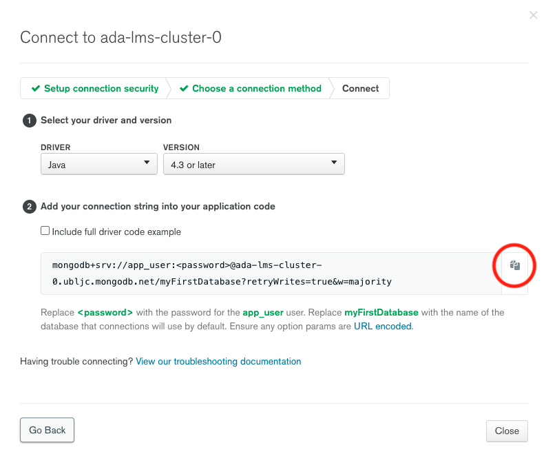
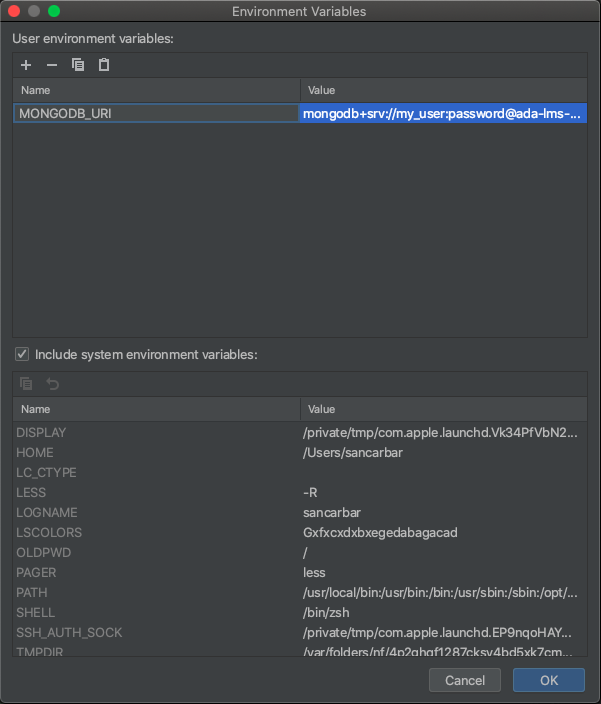

## Spring Boot Data with MongoDB

### Sebastián Villamarín Rodríguez
### IETI - LAB2

**Learning Objectives**

- Explain what MongoDB is.
- Explain the difference between SQL and NoSQL.
- Create a MongoDB Cluster on Atlas.
- Connect your Spring Boot project with a MongoDB Cluster.


## Detail Orientation 🤹🏽

Read the following document [Attention to details](https://www.csu.edu/humanresources/empdev/documents/AttentiontoDetail.pdf) 

**Main Topics**

* NoSQL.
* MongoDB.
* Cluster.


## Codelab 🧪

🗣️ "I hear and I forget I see and I remember I do and I understand." Confucius


### Part 1: Creating your Atlas account and first cluster:

If you haven't created your MongoDB Cluster follow part 1 - 4:

* [Get Started with Atlas](https://docs.atlas.mongodb.com/getting-started/)


### Part 2: Connecting my MongoDB Cluster with Spring Boot

1. Login into your [MongoDB Atlas account](https://account.mongodb.com/account/login)
2. Click *connect* on the cluster you created on Part 1:
   
   
   
3. Select *Connect your application*:
   
   
   
4. Choose the *Java* driver, select the latest version and copy the *connection string*:
   
   
   
5. Replace the *password* on the *connection string* with the password used when creating your database user.

   
   
7. Add an *Environment Variable* to the *application.properties* file to store the MongoDB URI:
    ````properties
    spring.data.mongodb.uri=${MONGODB_URI}
    ````
7. Add the environment variable to IntelliJ Idea by editing the Run/Debug Configurations:
   
   
   
   
   
   
   
   
7. Add the Spring Boot starter data MongoDB dependency to your *build.gradle*:
    ```groovy
       dependencies {
            implementation 'org.springframework.boot:spring-boot-starter-web'
            implementation 'org.springframework.boot:spring-boot-starter-data-mongodb'
            testImplementation 'org.springframework.boot:spring-boot-starter-test'
        }
    ```
8. Run your project and verify that the connection is successful.

### Part 3: Implementing the MongoDB Service

1. Create a new package called *repository*.
2. Create a new class called *UserDocument*:

   **Java:**
    ```java
      import org.springframework.data.annotation.Id;
      import org.springframework.data.mongodb.core.index.Indexed;
      import org.springframework.data.mongodb.core.mapping.Document;
      
      import java.util.Date;
      
      @Document
      public class UserDocument
      {
         @Id
         String id;
      
         String name;
      
         @Indexed( unique = true )
         String email;
      
         String lastName;
      
         Date createdAt;
      
         public UserDocument()
         {
         }
      }
   
     ```
   **Kotlin:**
     ```kotlin
         @Document
         class User(
            @Id var id: String?,
            var name: String,
            var lastName: String,
            @Indexed(unique = true)
            var email: String,
            var createdAt: Date
         )
     ```
3. Create a new interface called *UserRepository* inside the repository package:

   **Java:**
    ```java
      import org.springframework.data.mongodb.repository.MongoRepository;
      
      public interface UserRepository extends MongoRepository<UserDocument, String>
      {}
     ```
   **Kotlin:**
     ```kotlin
         interface UserRepository: MongoRepository<UserDocument, String>
     ```

4. Create a new *UserService* implementation called *UserServiceMongoDB* and inject inside the *UserRepository*:

   **Java:**
      ```java
         import java.util.List;
         
         public class UserServiceMongoDB
         implements UserService
         {
         
             private final UserRepository userRepository;
         
             public UserServiceMongoDB(@Autowired UserRepository userRepository )
             {
                 this.userRepository = userRepository;
             }
         
             @Override
             public User create( User user )
             {
                 return null;
             }
         
             @Override
             public User findById( String id )
             {
                 return null;
             }
         
             @Override
             public List<User> all()
             {
                 return null;
             }
         
             @Override
             public boolean deleteById( String id )
             {
                 return false;
             }
         
             @Override
             public User update( UserDto userDto, String id )
             {
                 return null;
             }
         }
    ```

   **Kotlin:**
     ```kotlin
         class UserServiceMongoDB(@Autowired private val userRepository: UserRepository) : UserService {
         override fun create(user: User): User? {
         return null
         }
         
             override fun findById(id: String): User? {
                 return null
             }
         
             override fun all(): List<User>? {
                 return null
             }
         
             override fun deleteById(id: String): Boolean {
                 return false
             }
         
             override fun update(userDto: UserDto, id: String): User? {
                 return null
             }
         }         
     ```
5. Implement the methods of the *UserServiceMongoDB* using the *UserRepository*.
6. Remove the *@Service* annotation from the *UserServiceHashMap* and add it to the *UserServiceMongoDB*.
7. Test your API and verify that your data is stored in your cluster.

### Challenge Yourself: Implement complex queries using the Spring Data Query Methods
1. Modify the *UserService* interface adding the following methods:

   **Java:**
    ```java
        List<User> findUsersWithNameOrLastNameLike(String queryText);
        
        List<User> findUsersCreatedAfter(Date startDate);
      {}
     ```
   **Kotlin:**
     ```kotlin
        fun findUsersWithNameOrLastNameLike(queryText: String): List<User>
        
        fun findUsersCreatedAfter(startDate: Date): List<User>
     ```
***Tip***: take a look at the official documenation and learn how to create custom queries with [Spring Data](https://docs.spring.io/spring-data/jpa/docs/current/reference/html/#jpa.query-methods.query-creation)

    

